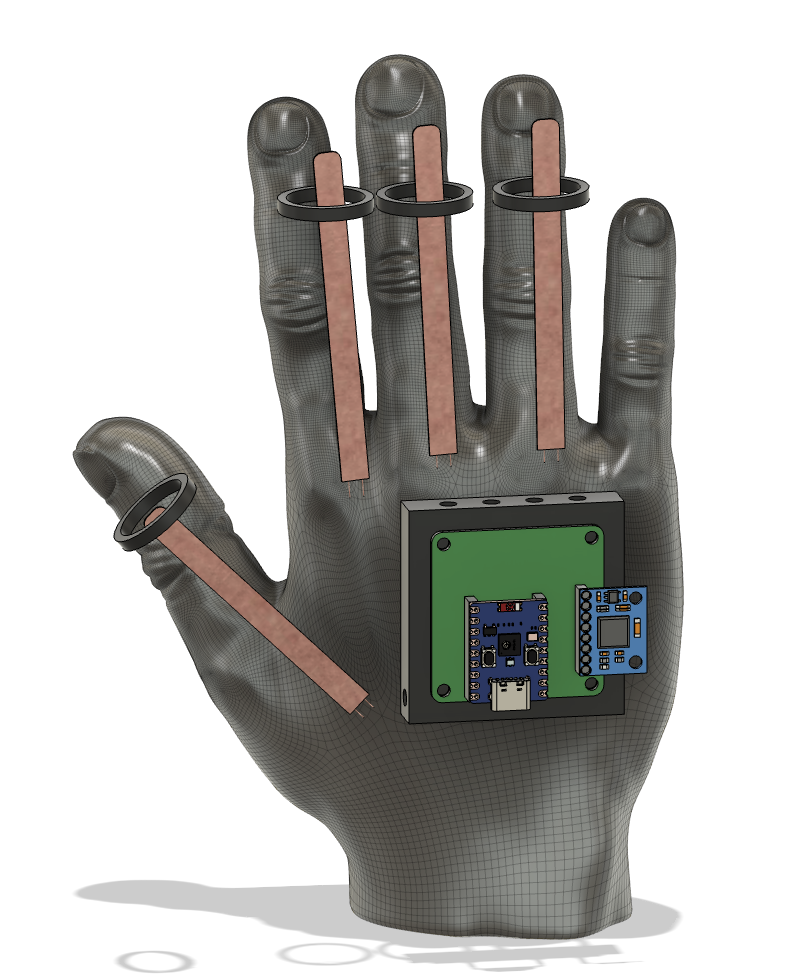
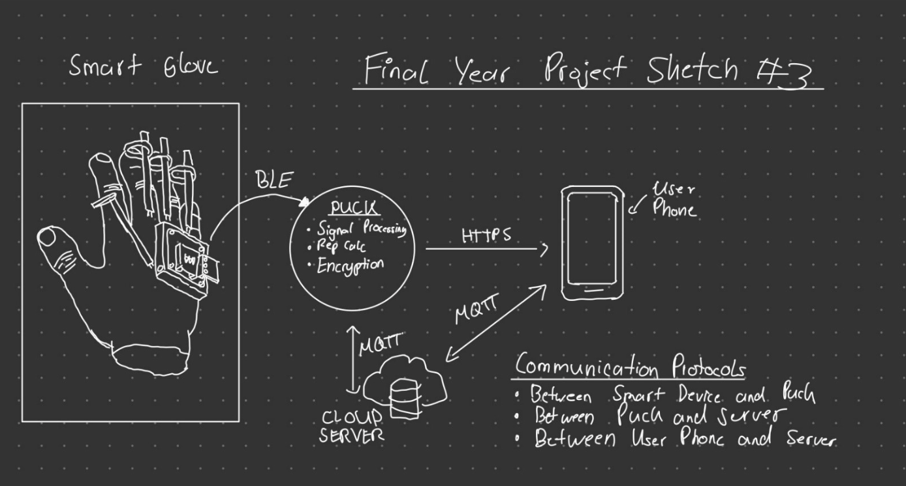

# Smart Gym Tracking Glove (ESP32 IoT Wearable)

Embedded IoT wearable glove designed to track gym repetitions and movement in real time using flex sensors and an IMU, transmitting data wirelessly to a cloud database via MQTT.

This project was developed as part of my Final Year Project in Mechatronic and Robotic Engineering at the University of Birmingham.

---

## CAD Design

The glove enclosure and electronics housing were designed in Fusion 360 to securely integrate the ESP32, sensors, and wiring into a wearable form factor.

---

## Hardware Prototype

The hardware was assembled using an ESP32 Feather development board, flex sensors, and an MPU6050 IMU. All components were soldered onto a vero board and integrated into the glove.

---

## Features

- Real-time repetition tracking
- Flex sensor finger bend detection
- IMU motion tracking (acceleration and orientation)
- Wireless data transmission using MQTT
- Cloud database integration
- Custom wearable hardware design
- Embedded firmware running on ESP32

---

## System Architecture

Data flow:

Flex Sensors + IMU  
→ ESP32 firmware  
→ MQTT broker  
→ Backend server  
→ Database

---

## Hardware Components

- ESP32 Feather microcontroller
- Flex sensors (x4)
- MPU6050 IMU
- Custom vero board circuit
- LiPo battery
- Custom CAD enclosure

---

## Software

Embedded Firmware:

- C++
- Arduino framework
- Sensor data acquisition
- MQTT communication

Backend:

- Python
- MQTT broker
- Database storage

## Author

Florian Mealing  
MEng Mechatronic and Robotic Engineering  
University of Birmingham

GitHub: https://github.com/fmealing  
LinkedIn: https://linkedin.com/in/florian-mealing
