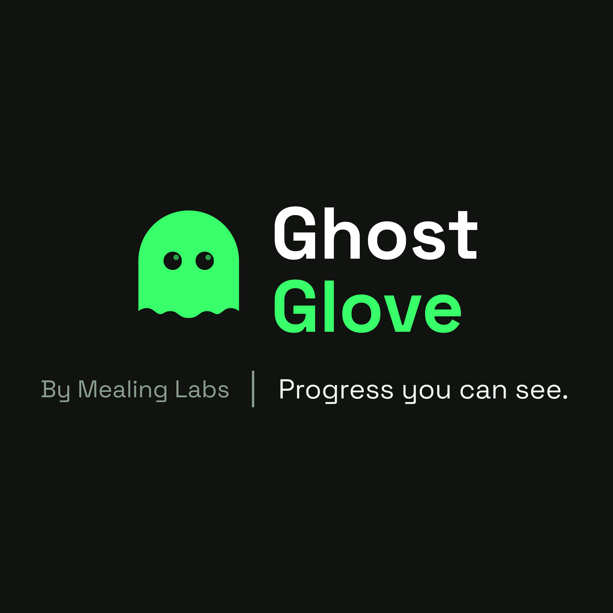
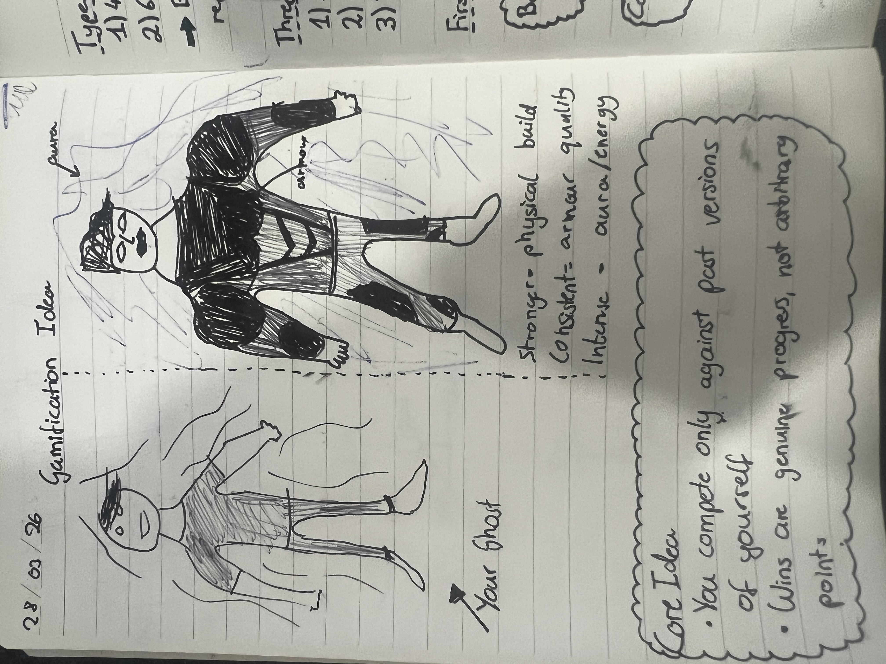
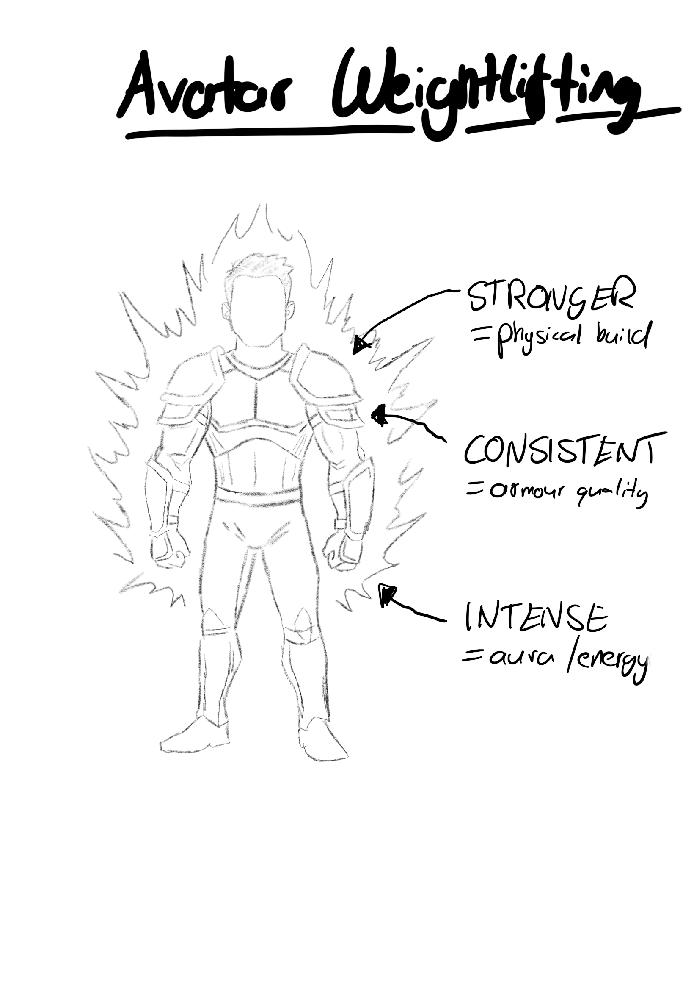
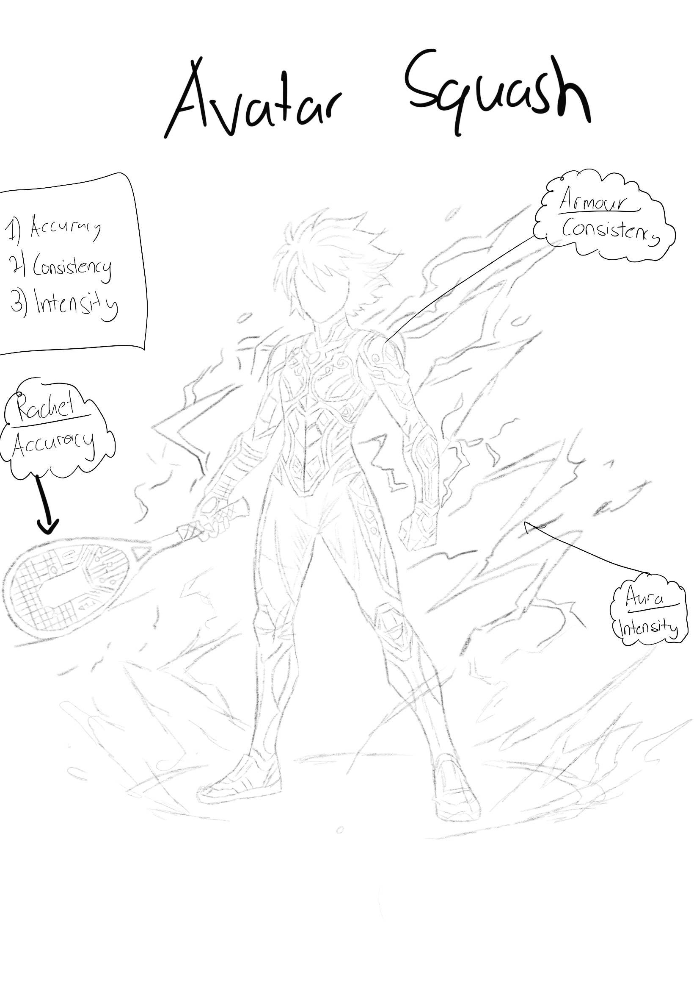
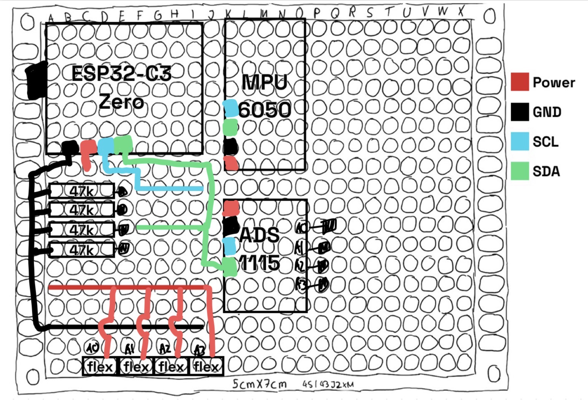
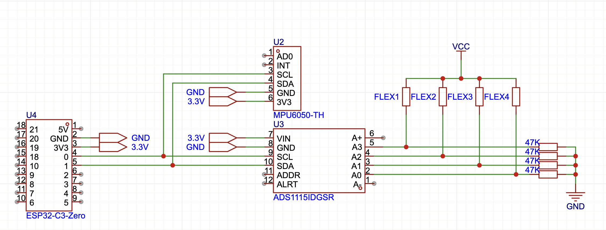
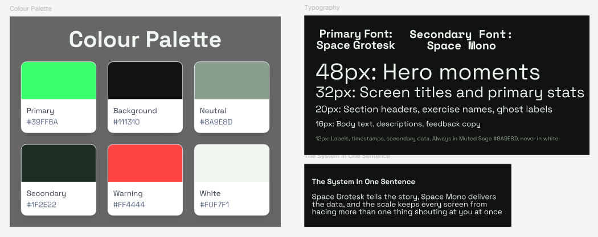
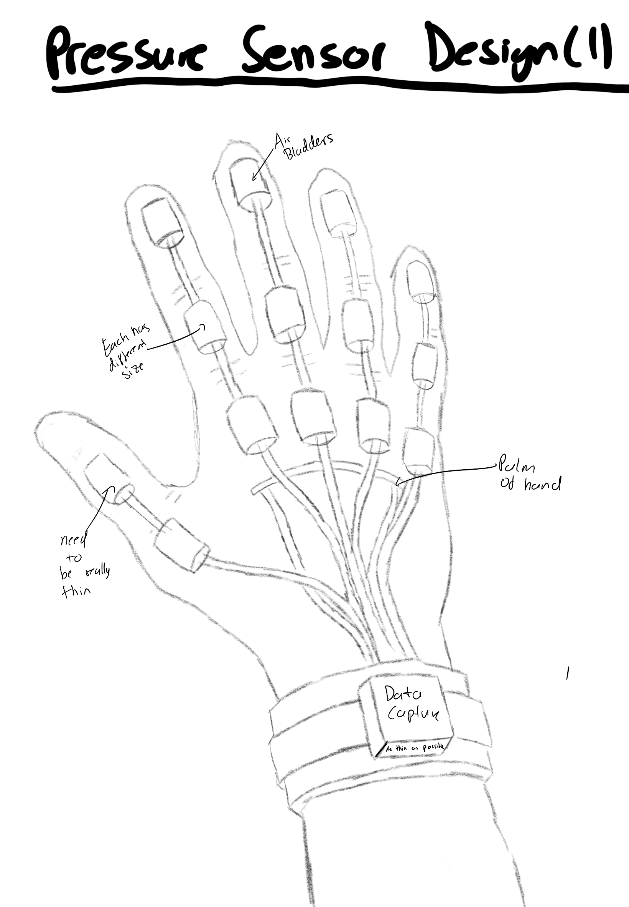
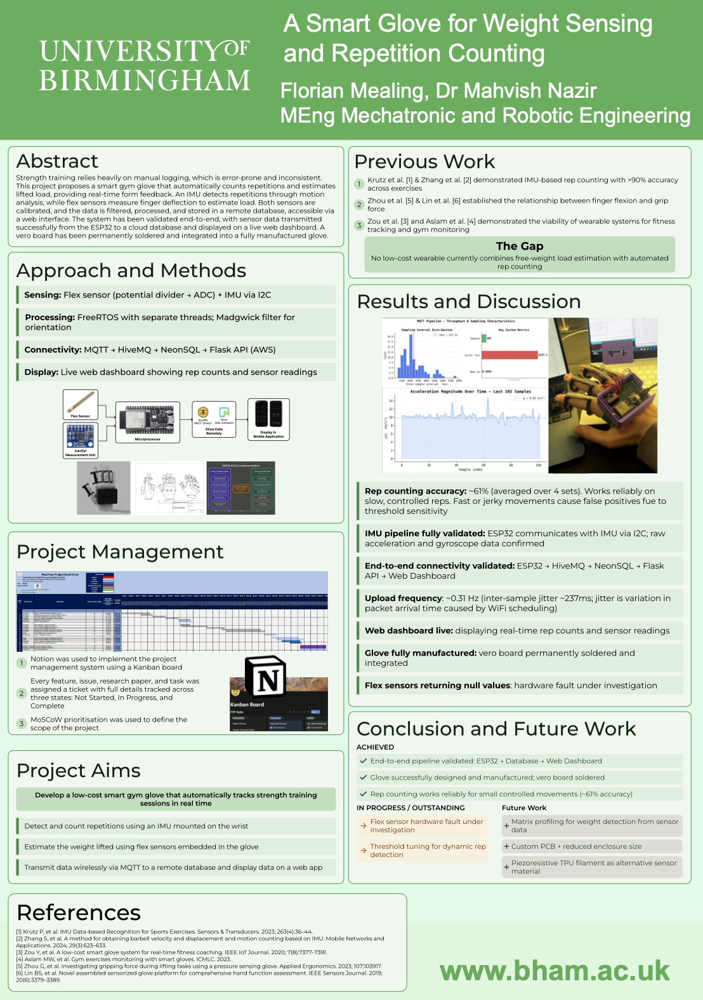

# Ghost Glove

**Progress you can see.**

A smart gym glove that automatically tracks strength training sessions in real time, built as a Final Year Project for MEng Mechatronic and Robotic Engineering at the University of Birmingham.

> By Mealing Labs

---



---

## The Idea

Most people who join the gym quit. Not because they lack motivation, but because they cannot see the progress. Numbers in a notebook feel abstract. Comparing yourself to others feels worse.

Ghost Glove solves this by changing the question: **what if your only opponent was your past self?**

Every session the glove records your performance and builds a ghost, a data-driven avatar of who you were. Over time, you race against previous versions of yourself. The gap is small at first. But it is real, and you cannot argue with it.

---

## User Story

> Jamie joined the gym in January. Not for the first time. Third time, actually.

Jamie is 24. The first two times he went hard for about three weeks, got bored, stopped seeing the point, and quietly let the membership lapse. This time he bought the glove because his flatmate would not stop talking about it.

**Day 1** -- He opens the app, pairs the glove, and gets told something he does not expect. "Your first session builds your opponent." There is no pressure, no benchmark to hit. He just trains, and the app watches. At the end he sees his avatar for the first time: weak, minimal gear, barely any aura. The app tells him: "This is January Jamie. You are going to make him irrelevant." He thinks it is a bit corny. He also screenshots it.

**Week 1** -- He trains twice. Nothing dramatic. The audio cues during sets are strange at first. But on his third session it tells him "you slowed down here last time" at rep six of a dumbbell row, and he pushes to rep eight out of pure stubbornness. He does not think much of it in the moment. But he remembers it on the walk home.

**Week 2** -- His consistency gear updates. Small change to the avatar, slightly better armour. He notices. He has not missed a session yet and the app reflects that without making a big deal of it. He shows his flatmate. His flatmate points out his ghost still looks terrible. Jamie goes to the gym the next morning.

**Week 3** -- First real ghost comparison drops. Current Jamie vs Week 1 Jamie on the same exercise. The gap is small but real: three more quality reps at the same weight. At the end of the set the app says: "you beat him." No fanfare. Just that. He stares at his phone for a second. This is the moment, not because the progress is huge, but because for the first time the progress is his, measured against himself.

**Week 6** -- Jamie is training three times a week now. He did not decide to; it just happened. Some sessions he loses, and the app does not punish him for it. It just updates the data. He has stopped thinking about what other people in the gym can lift. He has got his own thing to beat.

**Six months in** -- The six-month ghost appears for the first time. January Jamie, full avatar, standing next to current Jamie. The difference is visible across all three axes: bigger build, full gear set, bright aura. Jamie sends it to his flatmate without saying anything. His flatmate buys a glove the next day.

---

## User Journey

The journey was designed before a single line of code was written. Three core phases:

| Phase | What Happens |
| -------------------- | -------------------------------------------------------------------------------------------------- |
| **Select & Connect** | Choose your workout. App loads your targets. Put on the glove and everything connects automatically. |
| **Track & Respond** | Reps counted automatically. App tracks proximity to failure in real time. |
| **Review & Evolve** | Set complete. App adjusts the next target automatically and shows what you achieved. |


*Initial concept sketches, 16/03/26*

---

## Gamification

The core mechanic: **you compete only against past versions of yourself.** Wins are genuine progress, not arbitrary points.

Your avatar evolves across three axes, each mapped to a real training metric:

| Axis | What It Measures | Visual Representation |
| -------------- | --------------------------------------------------- | ---------------------------- |
| **Stronger** | Progressive weight increase | Physical build / muscle mass |
| **Consistent** | Session attendance and streak | Armour quality |
| **Intense** | Effort per session (velocity, proximity to failure) | Aura / energy |

The ghost system operates across two timescales: a **4-week ghost** (your recent self) and a **6-month ghost** (who you were at the start). Beating one feels like momentum. Beating the other feels like transformation.





*Left: Original gamification concept (28/03/26). Right: Sport-specific avatar sketches. The system is designed to extend beyond weightlifting.*

---

## Hardware

Ghost Glove is a fully manufactured smart glove with permanently soldered electronics. The sensor stack:

- **Flex Sensors (x4)** -- measure finger bend angle via resistive voltage dividers. Resistor value: 47 kOhm, derived from a geometric mean of approximately 43.3 kOhm, near-optimal for mid-flex sensitivity.
- **MPU-6050 IMU** -- 6-DOF accelerometer and gyroscope for wrist orientation and motion. Used for rep counting via a Madgwick filter.
- **ADS1115 ADC** -- 16-bit external ADC. Resolves the ADC2/WiFi conflict inherent to the ESP32 by handling all analog reads independently.
- **ESP32-C3 Zero** -- the microcontroller. Compact, BLE-capable, runs FreeRTOS with separate sensor tasks.

All components are mounted on a **5 cm x 7 cm veroboard**, permanently soldered and integrated into the glove.




*Left: Hand-drawn veroboard layout. Right: EasyEDA schematic showing ESP32-C3 Zero, MPU-6050, ADS1115, and flex sensor voltage dividers.*

---

## System Architecture

```
[Flex Sensors] --+
                 +---> [ADS1115 ADC] --+
[MPU-6050 IMU] --+                    |
                                      v
                              [ESP32-C3 Zero]
                              FreeRTOS Tasks:
                              - Sensor read task
                              - IMU read task
                              - MQTT publish task
                                      |
                                      v  MQTT over WiFi
                               [HiveMQ Broker]
                                      |
                                      v
                              [NeonSQL Database]
                                      |
                                      v
                          [Flask API (AWS)] --> [Web Dashboard]
```

Data flow has been validated end-to-end. Upload frequency is approximately 0.31 Hz, with inter-sample jitter of around 237 ms from WiFi scheduling. The live web dashboard displays real-time rep counts and sensor readings.

---

## Software

### Firmware (ESP32-C3 / Arduino)

- **FreeRTOS** task architecture with separate threads for IMU read, ADC read, and MQTT publish
- **Madgwick filter** for orientation estimation from raw IMU data
- **I2C bus** shared between MPU-6050 and ADS1115
- **MQTT** publish to HiveMQ cloud broker

### Backend

- **HiveMQ** -- cloud MQTT broker
- **NeonSQL** -- PostgreSQL-compatible serverless database
- **Flask API** -- hosted on AWS, bridges MQTT data to the web dashboard

### Dashboard

Live web interface showing rep counts and sensor readings in real time.

---

## Results

| Metric | Result |
| --------------------- | ---------------------------------------------------------- |
| Rep counting accuracy | ~61% (averaged over 4 sets) |
| IMU pipeline | Fully validated -- raw accelerometer and gyroscope data confirmed |
| Connectivity | ESP32 to HiveMQ to NeonSQL to Flask to Dashboard: working |
| Upload frequency | ~0.31 Hz |
| Glove manufacture | Veroboard permanently soldered and integrated |
| Flex sensors | Hardware fault under investigation -- returning null values |

The system works reliably on slow, controlled reps. Fast or jerky movements cause false positives due to threshold sensitivity. Threshold tuning for dynamic rep detection is the primary in-progress item.

---

## Design System

The app has a defined visual language built to feel like a training tool, not a health tracker.



| Token | Value |
| ------------------------ | ------------- |
| Primary (Electric Green) | `#39FF6A` |
| Background | `#111310` |
| Secondary | `#1F2E22` |
| Neutral (Muted Sage) | `#8A9E8D` |
| Warning | `#FF4444` |
| Primary Font | Space Grotesk |
| Secondary Font | Space Mono |

Space Grotesk carries the narrative. Space Mono delivers the data. The type scale ensures no single screen has more than one element competing for attention.

---

## Future Work

### Hardware

- [ ] Resolve flex sensor hardware fault and investigate null value root cause
- [ ] Custom PCB to replace veroboard and reduce enclosure size
- [ ] Piezoresistive TPU filament as an alternative flex sensing material
- [ ] Pressure Sensor Design 2: per-finger air bladder system with thin-profile construction



*V3 concept: per-finger air bladders with joint-level pressure sensing. Each bladder is sized differently and routes to a wrist-mounted data capture unit.*

### Software

- [ ] Threshold tuning for dynamic rep detection
- [ ] Matrix profiling for weight estimation from sensor data
- [ ] Ghost avatar system (4-week and 6-month comparisons)
- [ ] Mobile app (React Native) with Hale health score integration
- [ ] BLE transport to replace WiFi/MQTT for lower latency

---

## Academic Context

This project was submitted as a Final Year Project for the MEng Mechatronic and Robotic Engineering degree at the University of Birmingham, under the supervision of **Dr Mahvish Nazir**.



**TRL Assessment: TRL 3** -- subsystems validated independently. Simultaneous flex sensor and IMU transmission has been identified as the key hardware blocker preventing TRL 4.

**Project management:** Notion Kanban board with MoSCoW prioritisation. Every feature, issue, research paper, and task tracked across Not Started / In Progress / Complete.

---

## References

1. Krutz P, et al. *IMU Data-based Recognition for Sports Exercises.* Sensors & Transducers. 2023.
2. Zhang S, et al. *A method for obtaining barbell velocity and displacement and motion counting based on IMU.* Mobile Networks and Applications. 2024.
3. Zou Y, et al. *A low-cost smart glove system for real-time fitness coaching.* IEEE IoT Journal. 2020.
4. Aslam MW, et al. *Gym exercises monitoring with smart gloves.* ICMLC. 2023.
5. Zhou G, et al. *Investigating gripping force during lifting tasks using a pressure sensing glove.* Applied Ergonomics. 2023.
6. Lin BS, et al. *Novel assembled sensorized glove platform for comprehensive hand function assessment.* IEEE Sensors Journal. 2019.

---

## Author

**Florian Mealing** -- MEng Mechatronic and Robotic Engineering, University of Birmingham (2022--2026)

- [florianmealing.com](https://florianmealing.com)
- [LinkedIn](https://linkedin.com/in/florianmealing)
- [YouTube](https://www.youtube.com/@florianmealing)

---


*By Mealing Labs*
